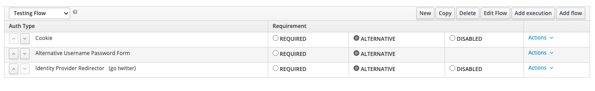
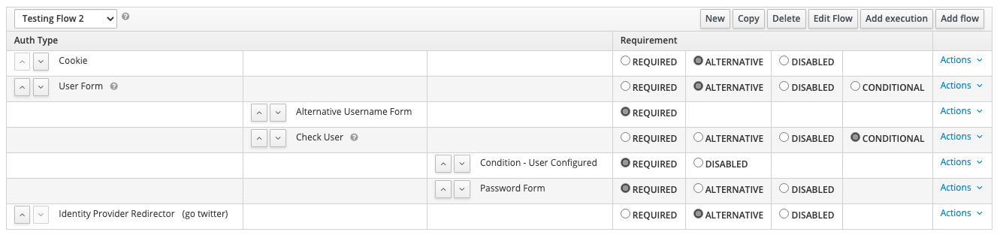

# Alternative-usernamepasswordform-authenticator
this custom authenticator implementation extends the original ``Username Password Form`` execuation flow in Keycloak.  
It adds 'Alternative' to the original one and doesn't stop the execution flow if the user is not valid.

It can be helpful in case of automatically redirecting to another provider if the user isn't valid in the default one.  
If it's marked as 'Required', the extension will behave as the original one : stopping the flow and raising the error message. 

# Alternative-usernameform-authenticator
this custom authenticator implementation extends the original ``Username Form`` execuation flow in Keycloak.  
It allows to validate a user but doesn't stop the execution flow if the user is not valid.
Best used with conditional flows in case of extra actions needed when a user doesn't exist.

# Deployment
```shell script
mvn clean package
cp target/*.jar $KEYCLOAK_HOME/standalone/deployments/
```

# Keycloak Configuration
 
## alternative username password form
1. Go to Authentication menu
2. Create or edit a custom flow
3. Add execution
4. Pick up from the list the ``Alternative Username Password Form``  

A flow example :


## alternative username form
1. Go to Authentication menu
2. Create or edit a custom flow
3. Add execution
4. Pick up from the list the ``Alternative Username Form``  

A flow example :
